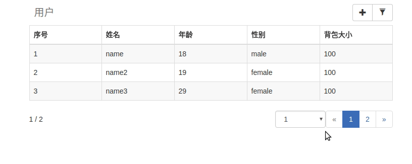
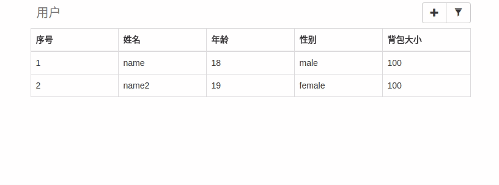

# Bootstrap Data Table

Bootstrap DataTable 是一个可以简单快速创建一个功能齐全的数据表格的Jquery插件

[](https://github.com/yws179/bootstrap-data-table/blob/master/LICENSE)

# 已完成功能
- [x] 基本数据渲染
- [x] 数据过滤
- [x] 数据排序
- [x] 数据添加
- [x] 数据删除
- [x] 数据替换
- [x] 数据获取
- [x] 数据列事件监听
- [x] 分页

# 基本演示

导入相关js/css后，html只需要写以下这一句即可

```html
<table id="tb-sample"></table>
```

允许自行添加`<caption>` `<thead>` `<tbody>`标签

```html
<table id="tb-sample">
    <caption></caption>
    <thead></thead>
    <tbody></tbody>
</table>
```

### 初始化

```javascript
$('#tb-sample').dataTable({
  title: '用户',			    	// 标题
  filterable: true,			// 开启过滤筛选功能
  pageable: true,			// 开启分页功能
  pageSize: 3,				// 单页显示数据个数，默认10
  page: 1,				// 当前页，默认1
  fields: {				// 显示的字段，以及列名
    id: '序号',
    name: '姓名',
    age: '年龄',
    gender: '性别',
    'bag.size': '背包大小'
  },
  buttons: [				//添加自定义按钮
    {
      dom: '<button class="btn btn-default btn-add" type="button" title="新增"><span class="glyphicon glyphicon-plus"></span></button>',
      events: {				//设置按钮事件
        click: function () {
          $('#modal-add').modal('show')
        }
      }
    }
  ],
  data: [				//初始化数据
    {
      id: 1,
      name: 'name',
      age: '18',
      gender: 'male',
      bag: {
        size: 100
      }
    },
    {
      id: 2,
      name: 'name2',
      age: '19',
      gender: 'female',
      bag: {
        size: 100
      }
    }
    //...
  ]
})
```



### 数据操作

```javascript
// 重新渲染整个列表，重置数据集
$('#tb-sample').dataTable('renderData', [....])

// 添加多个数据到数据集
$('#tb-sample').dataTable('addData', [{id: 3, name: 'new'}, {id: 4}])

// 添加单个数据到数据集
$('#tb-sample').dataTable('addData', {id: 5, name: 'five'})

//idx为dataTable中的索引
var idx = 3
var idxs = [2, 3, 5]

//根据数据获取idx
$('#tb-sample').dataTable('getIdx', data, function(idx) {
  alert(idx)
})

//移除单个数据
$('#tb-sample').dataTable('removeData', idx)

//移除多个数据
$('#tb-sample').dataTable('removeData', idxs)

//替换数据
$('#tb-sample').dataTable('replaceData', idx, {id: 1000, name: 'replaceData'})

//通过idx获取数据
$('#tb-sample').dataTable('getData', idx, function(data) {
  alert(JSON.stringify(data))
})

//通过idx数组获取数据集
$('#tb-sample').dataTable('getData', idxs, function(data) {
  alert(JSON.stringify(data))
})

//获取所有数据
$('#tb-sample').dataTable('getAllData', function(data) {
  alert(JSON.stringify(data))
})

```

### 事件监听

```javascript
/**
 * 添加点击监听
 * @param idx   dataTable中数据唯一标识
 * @param data  点击列所对应的数据项
 */
$('#tb-sample').dataTable('event', 'click', function (idx, data) {
    alert("单击， 数据：" + JSON.stringify(data))
})

$('#tb-sample').dataTable('event', 'mouseenter', function () {
  $(this).css('background', 'yellow')
}).dataTable('event', 'mouseleave', function () {
  $(this).css('background', 'white')
})
```

